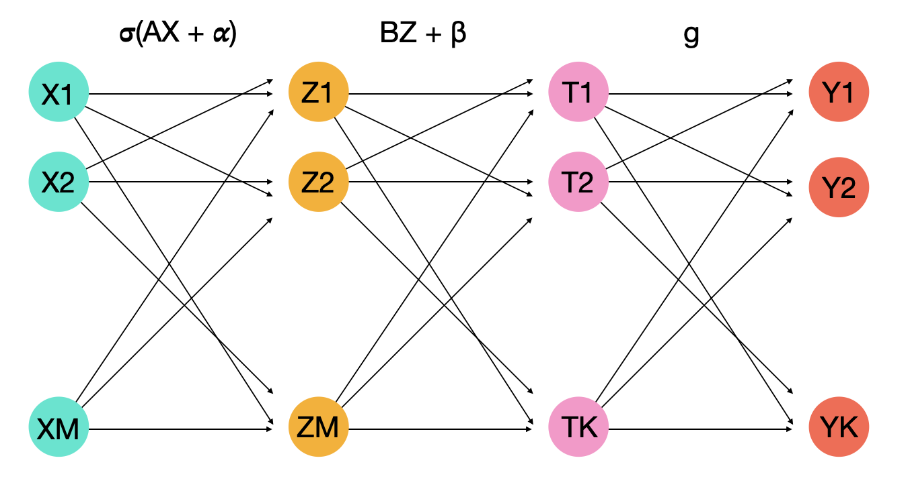

Let $\xi \in \mathbf{R}^{M \times 1}$ be some random feature-vector and consider the following derived features:

$$\nu = \sigma(A\xi + \alpha_0) \in \mathbf{R}^{M \times 1}$$

Where $\sigma$ is an entry-wise activation function and $A \in \mathbf{R}^{M \times M}$. If we define the hidden states (random vectors) as $\tau = B\nu + \beta_0$ where $B \in \mathbf{R}^{K \times M}$, then the one-hidden-layer MLP can be written as the following model:

$$\eta = g\big(B\sigma\big(A\xi + \alpha_0\big) + \beta_0\big)$$

Given a sample $X \in \mathbf{R}^{M \times N}$ of the random variable $\xi$ together with a sample $Y \in \mathbf{R}^{K \times N}$ of the r.v. $\eta$, we define the response (estimated) variable as:

$$\hat{Y} = g\big(\hat{B}\sigma\big(\hat{A}X + \hat{\alpha}_0\big) + \hat{\beta}_0\big)$$

Where $\hat{\theta} = (\hat{A}, \hat{\alpha}_0, \hat{B}, \hat{\beta}_0)$ are estimations for the parameters of the model. Fitting those parameters will need the addition of a minimizing condition over a loss function, usually:

Least-squares function (LSE): 
$$L(\theta) = \frac{1}{N}\mathbf{1}^{\intercal}\Big[\big(Y - \hat{Y}\big) \odot \big(Y - \hat{Y}\big)\Big]\mathbf{1}$$

Cross-entropy function (CE): 
$$L(\theta) = -\frac{1}{N}\mathbf{1}^{\intercal}\Big[Y \odot \log\big(\hat{Y}\big)\Big]\mathbf{1}$$

